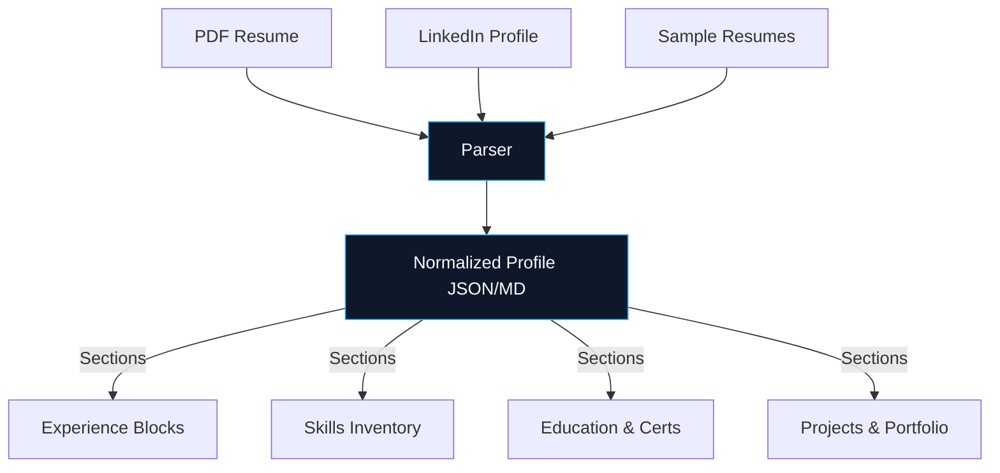
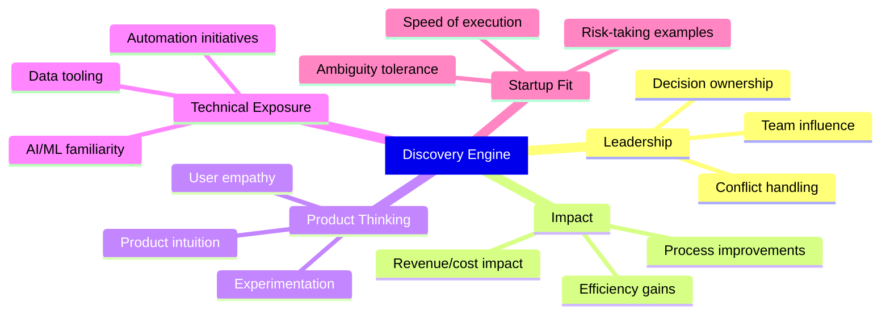
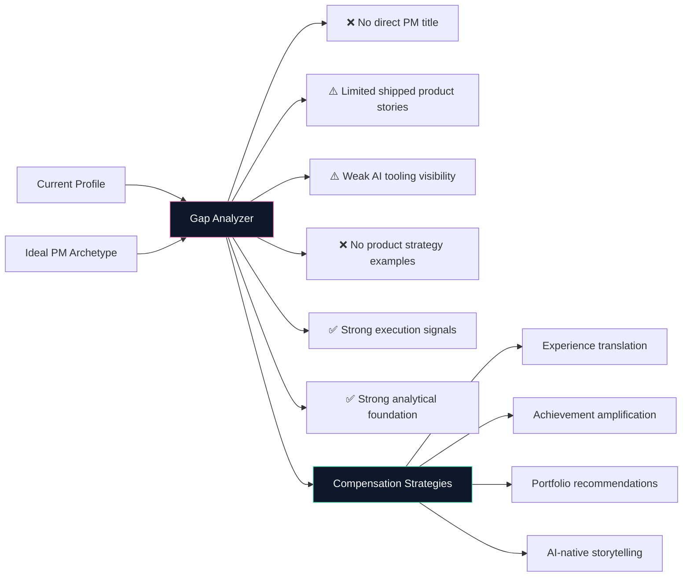
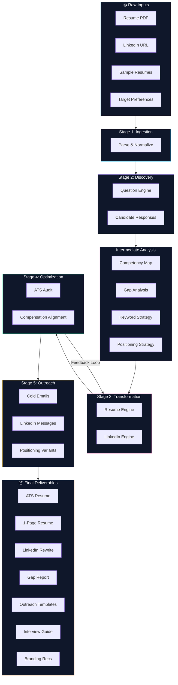
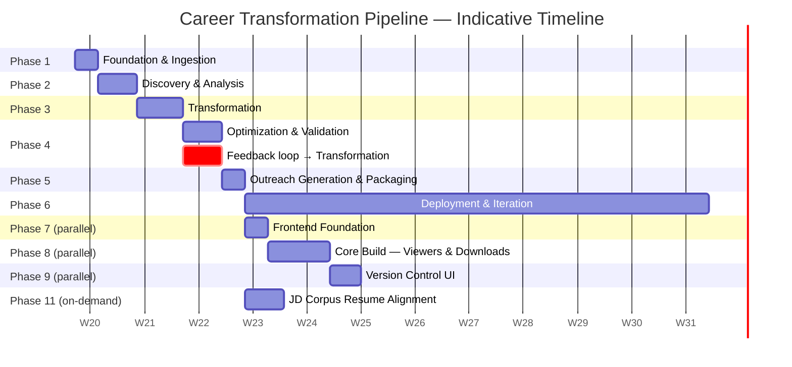
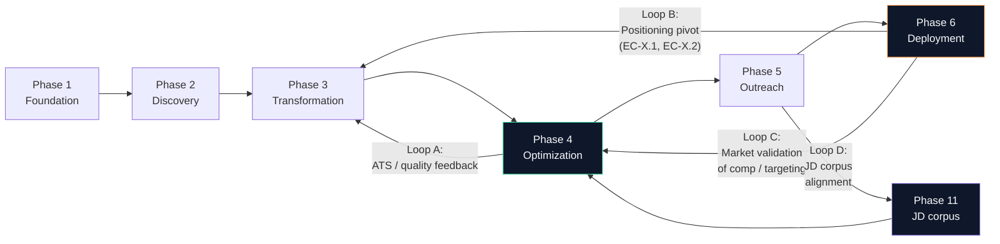

# Architecture: AI-Native Product Manager Career Transformation System

> **Derived from:** [problemstatement.md](./problemstatement.md)
> **Version:** 1.0
> **Date:** 2026-05-15

---

## 1. System Overview

The system is an **end-to-end, AI-powered career transformation engine** that takes raw career inputs (resume, LinkedIn, experience data) and produces a fully optimized set of professional branding assets repositioned for **AI-native Product Manager roles** at high-growth startups.

It operates as a **multi-stage pipeline** — each stage ingesting the output of the previous one — with human-in-the-loop checkpoints for factual grounding.


---

## 2. Architecture Principles

| Principle | Description |
|---|---|
| **Factual Grounding** | No fabrication of achievements, metrics, or experience. All output is reframed, never invented. |
| **Progressive Enrichment** | Each pipeline stage enriches the candidate profile; no stage discards upstream data. |
| **Human-in-the-Loop** | Candidate validates key outputs (gap analysis, reframed bullets) before downstream stages consume them. |
| **Modular Pipelines** | Each module is independently executable and testable; outputs are structured artifacts (Markdown/JSON). |
| **PM-First Language** | Every textual output defaults to Product Management vocabulary, startup tone, and metrics-driven framing. |

---

## 3. Directory Structure

```
Resume/
├── Current Resume/
│   └── Anchit.Boruah_Resume.pdf          # Raw input resume
├── Sample Resume/
│   ├── FAANGResumeTemplate.pdf           # Reference template (FAANG format)
│   └── SakshamArora.pdf                  # Reference template (1-page PM)
├── docs/
│   ├── problemstatement.md               # Requirements specification
│   └── architecture.md                   # This file
├── inputs/                               # ← NEW: Structured candidate inputs
│   ├── experience.md                     # Detailed role-by-role experience
│   ├── achievements.md                   # Quantified achievements & impact
│   ├── linkedin_profile.md               # Current LinkedIn snapshot
│   ├── target_roles.md                   # Target role preferences & companies
│   ├── discovery_responses.md            # Candidate answers to discovery Q's
│   └── job_descriptions/                 # Phase 11: sample PM JD corpus (jd-01.md … jd-20.md)
├── analysis/                             # ← NEW: Intermediate analysis artifacts
│   ├── competency_map.md                 # Transferable PM competencies extracted
│   ├── gap_analysis.md                   # Gaps vs. ideal PM profile
│   ├── keyword_strategy.md              # PM + AI keyword targeting plan
│   ├── positioning_strategy.md          # Narrative positioning blueprint
│   ├── market_feedback.md               # Phase 6 deployment signals (optional until live)
│   └── jd_corpus_synthesis.md           # Phase 11: JD corpus → keyword map → resume edit checklist
├── outputs/                              # ← NEW: Final deliverables
│   ├── resume_ats_optimized.md          # ATS variant — mirrors Prepared Resumes (see docs/resume_structure.md)
│   ├── resume_one_page.md               # Bullet variant — same structure as prepared final draft
│   ├── Prepared Resumes/                # Canonical DOCX/PDF final draft (DEC-23)
│   ├── linkedin_rewrite.md              # Complete LinkedIn profile rewrite
│   ├── outreach/                        # Outreach templates
│   │   ├── cold_emails.md
│   │   ├── linkedin_messages.md
│   │   ├── recruiter_outreach.md
│   │   └── founder_outreach.md
│   ├── interview_positioning.md         # PM interview guidance
│   └── personal_branding.md             # Branding recommendations
├── prompts/                              # ← NEW: Reusable prompt templates
│   ├── discovery_questions.md
│   ├── resume_transform.md            # DEC-23 structure + sync rules
│   ├── ats_audit.md
│   ├── linkedin_optimize.md
│   ├── outreach_generate.md
│   └── jd_corpus_analysis.md            # Phase 11: AI-assisted corpus extraction prompt
└── frontend/                             # ← NEW (Phase 7+): NorthStar AI web app
    ├── app/                              # Next.js App Router routes
    │   ├── (public)/                     # Public showcase layer
    │   │   ├── page.tsx                  # Landing
    │   │   ├── resume/                   # ATS + one-page viewers + PDF download
    │   │   ├── projects/                 # Case study gallery
    │   │   └── branding/                 # Personal branding view
    │   └── (workbench)/                  # Private layer — passcode-gated
    │       ├── outreach/                 # Templates by company type
    │       ├── interview/                # Positioning + comp playbook
    │       ├── versions/                 # Diff viewer for outputs/archive/
    │       ├── jd-alignment/             # Phase 11: JD corpus + paste-new-JD (workbench)
    │       └── feedback/                 # Market feedback dashboard (Phase 6)
    ├── content/                          # Symlink/mirror of outputs/ + analysis/ at build time
    ├── lib/                              # MD parsing (gray-matter), diff, PDF gen
    ├── components/                       # Shared UI (consistent with portfolio Framer Motion style)
    ├── public/                           # Pre-built PDFs from Phase 4
    └── middleware.ts                     # Auth gate for /workbench routes
```

---

## 4. Pipeline Architecture — Detailed Breakdown

### Stage 1: Ingestion Module

**Purpose:** Parse, normalize, and structure all raw candidate inputs into a machine-readable format.



| Input | Format | Output |
|---|---|---|
| `Anchit.Boruah_Resume.pdf` | PDF | `inputs/experience.md` — structured role-by-role breakdown |
| LinkedIn profile URL | Web | `inputs/linkedin_profile.md` — headline, about, experience, skills |
| Sample resumes | PDF | Internal reference for formatting & tone benchmarking |
| Candidate clarifications | Conversational | `inputs/discovery_responses.md` |

> **IMPORTANT:** The ingestion stage must preserve **all** original data points. Nothing is discarded — only annotated for downstream consumption.

---

### Stage 2: Discovery Module

**Purpose:** Actively interrogate the candidate to uncover hidden PM signals, leadership moments, and impact metrics that aren't visible in the raw resume.

#### Discovery Dimensions



#### Discovery Question Categories

| Category | Signal Targeted | Example Question |
|---|---|---|
| Leadership | Decision ownership | "Describe a time you made a significant decision without full data. What was the outcome?" |
| Impact | Revenue/business impact | "What is the most measurable business outcome you directly influenced?" |
| Process | Operational efficiency | "Have you ever redesigned a process? What was the before/after?" |
| AI Exposure | AI-native positioning | "How have you used AI tools in your current workflow?" |
| Stakeholder Mgmt | Cross-functional collaboration | "Describe managing competing priorities from different stakeholders." |
| Product Intuition | PM mindset | "Have you ever identified a user pain point before anyone else? What did you do?" |

**Output:** `inputs/discovery_responses.md` + enriched `analysis/competency_map.md`

---

### Stage 3: Transformation Module

**Purpose:** The core engine. Takes normalized inputs + discovery data and produces reframed, PM-aligned professional narratives.

#### 3A — Competency Mapping

Maps raw BA/QA/Sales experience → PM competency framework:

| Source Experience | PM Competency | Reframing Strategy |
|---|---|---|
| Requirement gathering | Product discovery & user research | Reframe as "defining product requirements through user signal analysis" |
| Stakeholder management | Cross-functional leadership | Position as "aligning engineering, design, and business stakeholders" |
| Process optimization | Product ops & efficiency | Frame as "driving operational scalability and workflow automation" |
| Data analytics | Product analytics & experimentation | Position as "data-driven prioritization and KPI ownership" |
| QA workflows | Quality-first product delivery | Frame as "ensuring product quality through systematic validation" |
| Sales experience | GTM alignment & customer empathy | Position as "customer-facing insight driving product roadmap" |
| Delivery coordination | Execution & shipping | Frame as "end-to-end product delivery with sprint-level ownership" |

**Output:** `analysis/competency_map.md`

#### 3B — Gap Analysis

Compares candidate profile against ideal PM archetype:



**Output:** `analysis/gap_analysis.md`

#### 3C — Resume Generation

Two resume variants produced:

| Variant | Target | Format | Optimization |
|---|---|---|---|
| **ATS-Optimized** | Automated screening systems | Clean, keyword-dense, semantic hierarchy | ATS score ≥ 90 |
| **One-Page Premium** | Human reviewers — founders, HMs | Concise, impact-heavy, startup tone | Visual scannability |

**Resume Bullet Formula:**
```
[Action Verb] + [PM-aligned activity] + [quantified outcome] + [business context]
```

Example transformation:
```diff
- Gathered requirements from business stakeholders and documented BRDs
+ Led product discovery for 3 enterprise modules, translating stakeholder needs into prioritized PRDs that reduced development rework by 35%
```

**Output:** `outputs/resume_ats_optimized.md`, `outputs/resume_one_page.md`

#### 3D — LinkedIn Rewrite

| Section | Optimization Goal |
|---|---|
| **Headline** | Recruiter-search-friendly; keywords: Product Manager, AI, Growth, Startup |
| **About** | High-authority narrative; PM mindset + execution + AI-native + startup-ready |
| **Experience** | Outcome-oriented PM bullets (mirroring resume but LinkedIn-native tone) |
| **Skills** | Injected PM + AI + recruiter-search keywords |
| **SEO** | Discoverability for: Product Manager, APM, AI PM, Growth PM, Product Ops |

**Output:** `outputs/linkedin_rewrite.md`

---

### Stage 4: Optimization Module

**Purpose:** Validate, score, and refine all outputs against quality benchmarks.

#### 4A — ATS Scoring & Audit

Validate resume against ATS scoring criteria:

| Criterion | Target | Validation Method |
|---|---|---|
| Keyword density | Optimal (not stuffed) | PM keyword frequency analysis |
| Formatting | ATS-safe | No tables, columns, headers only, clean hierarchy |
| Semantic structure | Machine-readable | H1 → H2 → bullet hierarchy |
| Keyword relevance | High match to target JDs | Cross-reference against PM job descriptions |
| Readability | Recruiter-friendly | Flesch-Kincaid ≤ Grade 12 |

**Benchmark platforms:** Enhancv, ResumeWorded, Jobscan, Rezi, Resume.io, Kickresume

**Output:** `analysis/keyword_strategy.md` (updated with audit results)

#### 4B — Positioning & Compensation Alignment

Ensure the profile justifies the **₹20 LPA → ₹35–40 LPA** compensation jump:

| Lever | Strategy |
|---|---|
| Seniority signaling | Frame scope of ownership, team influence, decision authority |
| Impact amplification | Quantify every bullet with revenue, efficiency, or scale metrics |
| AI-native premium | Position AI fluency as a differentiator (commands higher market rate) |
| Startup readiness | Signal execution speed, ambiguity tolerance, ownership mentality |

**Output:** `analysis/positioning_strategy.md`

---

### Stage 5: Outreach Module

**Purpose:** Generate personalized, high-conversion outreach assets for targeted job search.

#### Outreach Matrix

| Channel | Audience | Tone | Key Message |
|---|---|---|---|
| Cold email | Recruiters | Professional, concise | "PM with BA → PM transition, AI-native, metrics-driven" |
| Cold email | Founders | Bold, value-first | "Builder-executor who ships; startup-hardened" |
| LinkedIn DM | Hiring managers | Direct, outcome-focused | "Here's what I'd bring to your product team" |
| LinkedIn DM | Referral contacts | Warm, human | "Exploring PM roles — would love your perspective" |
| Follow-up | All | Persistent, respectful | Time-gated follow-up sequences |

#### Positioning Variants

| Company Type | Narrative Emphasis |
|---|---|
| Early-stage | Scrappiness, execution speed, wearing multiple hats |
| AI startups | AI fluency, automation thinking, technical collaboration |
| Product-led | User-centricity, experimentation, metrics ownership |
| Series B/C | Process maturity, cross-functional leadership, scaling ops |
| Founder-led hiring | Ownership mentality, bias for action, direct impact |

**Output:** `outputs/outreach/` directory (all templates)

---

## 5. Data Flow — End-to-End



---

## 6. Deliverable → Module Mapping

| # | Deliverable | Producing Module | Output Path |
|---|---|---|---|
| 1 | ATS-optimized PM resume | Transformation → Optimization | `outputs/resume_ats_optimized.md` |
| 2 | One-page premium startup resume | Transformation | `outputs/resume_one_page.md` |
| 3 | LinkedIn profile rewrite | Transformation | `outputs/linkedin_rewrite.md` |
| 4 | AI-native positioning strategy | Analysis | `analysis/positioning_strategy.md` |
| 5 | PM keyword optimization strategy | Optimization | `analysis/keyword_strategy.md` |
| 6 | Recruiter outreach templates | Outreach | `outputs/outreach/recruiter_outreach.md` |
| 7 | Founder outreach templates | Outreach | `outputs/outreach/founder_outreach.md` |
| 8 | Cold email templates | Outreach | `outputs/outreach/cold_emails.md` |
| 9 | Networking message templates | Outreach | `outputs/outreach/linkedin_messages.md` |
| 10 | Gap analysis report | Analysis | `analysis/gap_analysis.md` |
| 11 | PM interview positioning guidance | Transformation | `outputs/interview_positioning.md` |
| 12 | Personal branding recommendations | Transformation | `outputs/personal_branding.md` |
| 13 | Startup application strategy | Analysis | `analysis/positioning_strategy.md` |
| 14 | ATS score optimization recommendations | Optimization | `analysis/keyword_strategy.md` |

---

## 7. Prompt Engineering Strategy

Each pipeline stage is powered by a dedicated prompt template stored in `prompts/`.

| Prompt | Stage | Purpose |
|---|---|---|
| `discovery_questions.md` | Discovery | Generate deep follow-up questions targeting PM signals |
| `resume_transform.md` | Transformation | PM-framed narratives; **must follow** `docs/resume_structure.md` (DEC-23) |
| `linkedin_optimize.md` | Transformation | Rewrite LinkedIn sections with SEO + PM positioning |
| `outreach_generate.md` | Outreach | Generate personalized cold emails & messages |
| `ats_audit.md` | Optimization | Audit resume for ATS compliance & keyword density |

### Prompt Design Principles

1. **Role priming** — Each prompt establishes the AI as a senior PM career strategist
2. **Few-shot examples** — Include before/after bullet transformations as in-context examples
3. **Constraint injection** — Explicitly forbid fabrication; require factual grounding
4. **Output schema** — Define expected Markdown structure for every output
5. **Iterative refinement** — Prompts include self-critique steps ("Review your output for generic phrasing and strengthen")

---

## 8. Execution Plan — Phased Approach

The system executes in **six core pipeline phases** (1–6) plus **parallel presentation (7–10)** and an **on-demand JD alignment track (11)**. Phases 1–5 produce deliverables; Phase 6 deploys them in-market. Each phase has a defined objective, duration estimate, ownership split, inputs/outputs, a binding **quality gate** (see Section 9), invoked **design decisions** (see [decisions.md](./decisions.md)), and **edge cases** to monitor (see [edgecases.md](./edgecases.md)).

### 8.0 — Phase Timeline Overview



> **Note:** Durations are working-day estimates assuming responsive candidate-in-the-loop turnaround. Phase 4 overlaps Phase 3 due to the Optimization → Transformation feedback loop (DEC-1). **Phases 7–9 (the NorthStar AI frontend) run in parallel with Phase 6** — the frontend consumes Phase 1–5 artifacts and does not block the markdown pipeline. **Phase 10 (production deploy / portfolio integration) is discarded** — NorthStar AI is for **private local use**; the candidate handles any hosting manually (DEC-22). **Phase 11** is an on-demand / repeatable track: ingest a corpus of real job descriptions → synthesize keywords → align resumes (may re-trigger Loop A / Phase 3–4 without redoing discovery).

---

### Phase 1: Foundation & Ingestion (Current Sprint)

| Attribute | Detail |
|---|---|
| **Objective** | Establish the workspace and produce a structured, machine-readable baseline of every candidate input. |
| **Duration (est.)** | 2–3 working days |
| **Owners** | Candidate (input collection) · System (parsing & normalization) |
| **Inputs** | Resume PDF · LinkedIn URL · Sample resumes (FAANG, 1-page PM) · Target role preferences · Compensation expectations |
| **Outputs** | Populated `inputs/` directory: `experience.md`, `achievements.md`, `linkedin_profile.md`, `target_roles.md` |
| **Quality Gate** | **G1 — Input Completeness** |
| **Key Decisions Invoked** | DEC-2 (Markdown primary) · DEC-3 (1-page PM template priority) · DEC-11 (archive-based versioning) · DEC-13 (India-first calibration) |
| **Edge Cases to Monitor** | EC-1.1 (unstructured PDF) · EC-1.2 (private LinkedIn) · EC-1.3 (sparse inputs) · EC-1.4 (divergent sample resumes) |
| **Exit Criteria** | All `inputs/*.md` files populated · zero missing sections in the intake checklist · candidate confirms inputs are accurate |

**Activities:**
- [x] Problem statement defined → `docs/problemstatement.md`
- [x] Architecture documented → `docs/architecture.md`
- [x] Design decisions recorded → `docs/decisions.md`
- [x] Edge cases catalogued → `docs/edgecases.md`
- [x] Set up `inputs/`, `analysis/`, `outputs/`, `outputs/archive/`, `prompts/` directories
- [x] Parse `Current Resume/Anchit.Boruah_Resume.pdf` into `inputs/experience.md` (role-by-role structured breakdown)
- [x] Extract quantified achievements into `inputs/achievements.md`
- [x] Snapshot current LinkedIn profile (headline, about, experience, skills) into `inputs/linkedin_profile.md`
- [x] Define target roles, company stages, and compensation tiers in `inputs/target_roles.md`
- [x] Run G1 completeness checklist; fall back to manual transcription if any extraction fails (EC-1.1, EC-1.2)

---

### Phase 2: Discovery & Analysis

| Attribute | Detail |
|---|---|
| **Objective** | Surface hidden PM signals via structured interrogation; map transferable competencies; identify gaps vs. the ideal PM archetype. |
| **Duration (est.)** | 3–5 working days (gated by candidate response turnaround) |
| **Owners** | System (question engine, analysis) · Candidate (interactive response) |
| **Inputs** | Phase 1 outputs (full `inputs/` directory) |
| **Outputs** | `inputs/discovery_responses.md` · `analysis/competency_map.md` · `analysis/gap_analysis.md` · `analysis/keyword_strategy.md` (initial draft) |
| **Quality Gate** | **G2 — Discovery Depth** |
| **Key Decisions Invoked** | DEC-4 (interview litmus test begins) · DEC-12 (adaptive discovery depth, floor 3 / target 5 per category) |
| **Edge Cases to Monitor** | EC-2.1 (vague responses → drill-down) · EC-2.2 (genuine PM gaps → flag, don't fabricate) · EC-2.3 (over-claims → litmus test) · EC-2.4 (career gaps) · EC-2.5 (refused questions) |
| **Exit Criteria** | ≥ 3 high-signal responses per discovery category (target 5 for weak areas) · candidate validates `competency_map.md` · gap analysis explicitly lists known limitations with remediation plans |

**Activities:**
- [x] Generate discovery questions from `prompts/discovery_questions.md` across all 5 dimensions (Leadership, Impact, Product Thinking, Technical Exposure, Startup Fit)
- [x] Run interactive discovery session; capture verbatim responses in `inputs/discovery_responses.md`
- [x] Apply adaptive depth logic (DEC-12): extend questioning where signals are weak; truncate where signals are strong
- [x] Map raw responses → PM competency framework → `analysis/competency_map.md`
- [x] Run gap analysis against ideal PM archetype → `analysis/gap_analysis.md` (flag each gap as Critical / Moderate / Strength)
- [x] Recommend portfolio / side-project remediation for any critical gaps (EC-2.2)
- [x] Generate initial keyword strategy → `analysis/keyword_strategy.md` (target PM + AI + recruiter-search keywords)
- [x] Candidate review and sign-off on competency map before progressing

---

### Phase 3: Transformation

| Attribute | Detail |
|---|---|
| **Objective** | Convert normalized inputs and analysis artifacts into reframed, PM-aligned narratives across resume, LinkedIn, interview, and branding materials. |
| **Duration (est.)** | 4–6 working days |
| **Owners** | System (generation) · Candidate (review and authenticity attestation) |
| **Inputs** | All Phase 2 outputs · Sample resume templates · Prompts from `prompts/` |
| **Outputs** | `outputs/resume_ats_optimized.md` · `outputs/resume_one_page.md` · `outputs/linkedin_rewrite.md` · `outputs/interview_positioning.md` · `outputs/personal_branding.md` · canonical bullet set stored in `analysis/competency_map.md` |
| **Quality Gate** | **G3 — Narrative Quality** |
| **Key Decisions Invoked** | DEC-4 (interview litmus test on every bullet) · DEC-9 (canonical bullet set as single source of truth) · DEC-10 (PM jargon ≤ 2 terms per bullet) |
| **Edge Cases to Monitor** | EC-3.1 (reframing → fabrication) · EC-3.2 (jargon overload) · EC-3.3 (resume variant divergence) · EC-3.4 (LinkedIn-resume mismatch) · EC-3.5 (no quantifiable metrics) |
| **Exit Criteria** | Zero generic or passive bullets · every bullet has either a quantified outcome **or** a scope anchor (team size, duration, stakeholder count) · PM-vocabulary audit passed · candidate sign-off on canonical bullet set |

**Activities:**
- [x] Lock the **canonical bullet set** in `analysis/competency_map.md` (DEC-9 — all downstream outputs derive from this)
- [x] Apply the bullet formula: `[Action Verb] + [PM-aligned activity] + [quantified outcome] + [business context]`
- [x] **Benchmark tone against `Sample Resume/SakshamArora.pdf`** (DEC-3): concise, impact-dense startup PM style
- [x] **Lock section structure to prepared final draft** (DEC-23, `docs/resume_structure.md`): Summary → Experience → Projects → Skills → Education; project order Groww → RAG → Swish → Meta
- [x] **Cross-check ATS hierarchy against `Sample Resume/FAANGResumeTemplate.pdf`** (structural validation only per DEC-3, EC-1.4): confirm machine-readable section headers, no tables/columns, clean H1→H2→bullet hierarchy
- [x] Generate ATS-optimized resume (keyword-dense variant) → `outputs/resume_ats_optimized.md`
- [x] Generate one-page premium startup resume (condensed variant, same claims) → `outputs/resume_one_page.md`
- [x] **Re-align both resumes to the Saksham template** if benchmarking surfaces structural deltas (track in feedback loop A — Section 8.X)
- [x] Generate LinkedIn rewrite (headline → about → experience → skills, derived from canonical set, first-person tone) → `outputs/linkedin_rewrite.md`
- [x] Generate PM interview positioning guide (STAR-formatted stories per competency) → `outputs/interview_positioning.md`
- [x] Generate personal branding recommendations (positioning statement, content pillars, profile photo guidance) → `outputs/personal_branding.md`
- [x] Apply the **interview litmus test** to every bullet (DEC-4): *"Can the candidate defend this in detail in a PM interview?"*
- [x] Run jargon density audit per DEC-10 (≤ 2 PM terms per bullet)
- [x] Run consistency audit across resume variants and LinkedIn (EC-3.3, EC-3.4)
- [ ] Candidate review pass — flag any bullet that crosses into uncomfortable territory (carries to G5 in Phase 5)
- [x] Apply qualitative impact framing where metrics are unavailable (EC-3.5)

---

### Phase 4: Optimization & Validation

| Attribute | Detail |
|---|---|
| **Objective** | Score and refine all deliverables against ATS and compensation-alignment benchmarks until quality thresholds are met. Runs the Optimization → Transformation **feedback loop**. |
| **Duration (est.)** | 3–5 working days (iterative; 2–3 audit cycles expected) |
| **Owners** | System (audit, scoring) · Candidate (validation of positioning shifts) |
| **Inputs** | Phase 3 outputs · Target ATS scoring criteria · Compensation benchmarks |
| **Outputs** | Refined `outputs/resume_*.md` and `outputs/linkedin_rewrite.md` · updated `analysis/keyword_strategy.md` (with audit results) · finalized `analysis/positioning_strategy.md` · PDF exports of resumes |
| **Quality Gate** | **G4 — ATS Compliance** |
| **Key Decisions Invoked** | DEC-5 (weighted-average ATS ≥ 90, 85+ floor) · DEC-6 (tiered compensation ranges) · DEC-10 (jargon density re-check) |
| **Edge Cases to Monitor** | EC-4.1 (score plateau < 90) · EC-4.2 (contradictory ATS scores) · EC-4.3 (unrealistic comp positioning) · EC-4.4 (PDF export breaks formatting) |
| **Exit Criteria** | Weighted-average ATS score ≥ 88 across Jobscan + ResumeWorded + Enhancv · no single platform < 85 · PDF export passes ATS re-parse · compensation positioning validated as defensible |

**Activities:**
- [x] Run ATS audit using `prompts/ats_audit.md` against scoring criteria (keyword density, formatting, semantic hierarchy, keyword relevance, readability)
- [x] Score resume on each benchmark platform: Enhancv · ResumeWorded · Jobscan · Rezi · Resume.io · Kickresume
- [x] Compute weighted average; identify lowest-scoring platform and root-cause the gap (EC-4.2)
- [x] **Feedback loop:** if any score below threshold, return to Phase 3 with targeted bullet revisions; do not keyword-stuff (EC-4.1)
- [x] Validate compensation positioning against tiered range strategy (DEC-6): Lead ₹30–35 LPA · Stretch ₹35–40 LPA (AI startups) · Floor ₹25–28 LPA + equity
- [x] Insert compensation negotiation playbook into `outputs/interview_positioning.md` (EC-X.3 prep)
- [x] Finalize `analysis/positioning_strategy.md` with 2–3 narrative variants for market resilience (EC-X.2)
- [x] Export resumes to PDF and re-parse through an ATS to confirm no formatting regression (EC-4.4) — see `outputs/pdf_export_guide.md` (candidate validates live)
- [x] Document all accepted trade-offs in `analysis/keyword_strategy.md`

---

### Phase 5: Outreach Generation & Packaging

| Attribute | Detail |
|---|---|
| **Objective** | Produce personalized, high-conversion outreach assets and package the complete deliverable bundle for candidate use. |
| **Duration (est.)** | 2–3 working days |
| **Owners** | System (template generation) · Candidate (hook personalization + final attestation) |
| **Inputs** | Phase 4 outputs · `inputs/target_roles.md` (target company list) |
| **Outputs** | `outputs/outreach/cold_emails.md` · `outputs/outreach/linkedin_messages.md` · `outputs/outreach/recruiter_outreach.md` · `outputs/outreach/founder_outreach.md` · final packaged bundle in `outputs/` with version header |
| **Quality Gate** | **G5 — Authenticity Check** (final candidate attestation across the entire deliverable set) |
| **Key Decisions Invoked** | DEC-8 (mandatory personalization hooks, not bulk templates) · DEC-11 (archive previous versions before publishing) |
| **Edge Cases to Monitor** | EC-5.1 (generic templates) · EC-5.2 (positioning-company mismatch) · EC-5.3 (spammy cadence) · EC-5.4 (LinkedIn rate limits) |
| **Exit Criteria** | All 14 deliverables present in `outputs/` · candidate signs final attestation (G5) · previous versions archived in `outputs/archive/v{N}/` |

**Activities:**
- [x] Generate cold email templates per audience (recruiters, founders, hiring managers, startup talent teams) using `prompts/outreach_generate.md`
- [x] Generate LinkedIn DM templates (networking, referrals, recruiter, founder, follow-up)
- [x] Generate 3 variant openings per template to avoid pattern detection (DEC-8)
- [x] Insert `[PERSONALIZATION_HOOK]` placeholders with usage instructions (EC-5.1)
- [x] Generate positioning variants by company type (early-stage · AI startups · product-led · Series B/C · founder-led)
- [x] Include a company classification guide in the outreach bundle (EC-5.2)
- [x] Document the **3-touch follow-up cadence** (initial → value-add at day 5–7 → close at day 10–14) per EC-5.3
- [x] Document LinkedIn outreach volume limits (20–30/day, 50/week) per EC-5.4
- [x] Run final consistency audit across all outputs (resume ↔ LinkedIn ↔ outreach)
- [x] Archive any previous deliverable versions to `outputs/archive/v{N}/` (DEC-11)
- [x] Apply version headers (`Version: X.Y | Date: YYYY-MM-DD`) to all final outputs
- [ ] Final candidate attestation (G5): confirm no fabricated achievements, metrics, or responsibilities anywhere in the bundle

---

### Phase 6: Deployment & Iteration

> **Scope note:** Phase 6 is **outside the artifact-production pipeline** — it is where the candidate deploys the deliverables in the real market. The system supports this phase by capturing market feedback and triggering re-execution of upstream phases when needed. The problem-statement success criteria (recruiter response rates, callbacks, compensation negotiation outcomes) are **only measurable in this phase**.

| Attribute | Detail |
|---|---|
| **Objective** | Deploy materials in-market, capture response signals, and iterate on positioning based on real recruiter / founder / HM feedback. |
| **Duration (est.)** | 4–12 weeks (ongoing until offer signed or pivot triggered) |
| **Owners** | Candidate (execution) · System (feedback capture, refinement support) |
| **Inputs** | Phase 5 deliverables · Live market response data |
| **Outputs** | `analysis/market_feedback.md` (new artifact — tracks response rates and signal patterns) · interview prep refinements · signed offer (success state) **or** triggered pivot (re-entry into Phase 3 or Phase 1) |
| **Quality Gate** | No new gate. Gates G1–G5 may be **re-triggered** if feedback drives material changes to upstream artifacts. |
| **Key Decisions Invoked** | DEC-6 (tiered comp negotiation) · DEC-7 (stealth-first LinkedIn rollout) · DEC-13 (India-first ecosystem assumptions validated against real market) |
| **Edge Cases to Monitor** | EC-X.1 (target role pivot) · EC-X.2 (market shifts) · EC-X.3 (below-target offer) · EC-X.5 (employer discovers job search) · EC-5.3 (cadence) · EC-5.4 (LinkedIn rate limits) |
| **Exit Criteria** | Signed offer within target compensation range, **or** candidate triggers a deliberate pipeline pivot (EC-X.1) — both are valid terminal states |

**Activities:**
- [ ] Execute **stealth LinkedIn rollout** (DEC-7) — Week 1: Headline + Skills · Week 2: About · Week 3: Experience (all with "Share profile updates" disabled) — *checklist in `market_feedback.md` + `/workbench/feedback`*
- [ ] Enable "Open to Work" in **recruiter-only** mode (EC-X.5) — *candidate action*
- [ ] Begin outbound outreach campaigns within volume limits (max 20–30 LinkedIn requests/day per EC-5.4) — *candidate action*
- [x] Track response rates, callback rates, and offer ranges in `analysis/market_feedback.md` (DEC-15 schema + frontmatter metrics)
- [ ] Run interview prep cycles using `outputs/interview_positioning.md` — *candidate action; linked from feedback dashboard*
- [ ] Execute compensation negotiation strategy per DEC-6 and the EC-X.3 playbook — *candidate action; offers logged in frontmatter*
- [x] Monitor for **pivot triggers** (DEC-16, EC-6.1 minimum sample) — *automated in `/workbench/feedback`*
  - Response rate < 5% over 50 outreach attempts → revisit positioning (re-enter Phase 4)
  - Recurring feedback "too junior" → re-enter Phase 3 with seniority-signaling revisions
  - Recurring feedback "over-reaching" → re-tune compensation tier per DEC-6
  - Target role pivot (EC-X.1) → re-enter from Phase 3
  - Market shift / hype-cycle change (EC-X.2) → swap narrative variant from `analysis/positioning_strategy.md`
- [x] Archive learnings after each major iteration — *§7 Iteration & Archive Notes in `market_feedback.md`*

---

---

### Phase 7: Frontend Foundation (NorthStar AI)

> **Track:** Parallel to Phase 6. Builds the **NorthStar AI** web app that surfaces all Phase 1–5 deliverables in a navigable, downloadable, version-aware UI. Reuses the candidate's existing portfolio stack (Next.js + Framer Motion + Vercel — see [portfolio](https://anchit-boruah-online-potfolio.vercel.app/)) for visual coherence.

| Attribute | Detail |
|---|---|
| **Objective** | Lock the frontend's architectural decisions, scaffold the Next.js app, and define the contracts between markdown artifacts and UI views. |
| **Duration (est.)** | 2–3 working days |
| **Owners** | Candidate (architect + developer) · System (scaffolding support) |
| **Inputs** | `outputs/` · `outputs/archive/` · `analysis/positioning_strategy.md` · existing portfolio repo (visual style + components) |
| **Outputs** | `frontend/` scaffolded · routing skeleton · MD ingestion library · auth middleware stub · PDF generation route stub · CI/Vercel config |
| **Quality Gate** | **G6 — Frontend Foundation Locked** |
| **Key Decisions Invoked** | DEC-17 (hosting model: subdomain of portfolio) · DEC-18 (public/private layer split) · DEC-19 (build-time MD sourcing) · DEC-20 (auth strategy) — *to be appended to `decisions.md` when this phase executes* |
| **Edge Cases to Monitor** | EC-7.1 (privacy leak to current employer) · EC-7.4 (portfolio integration breaks UX) — *to be appended to `edgecases.md`* |
| **Exit Criteria** | All four DEC-17→20 calls finalized · `frontend/` builds and runs locally (`npm run build` / `npm run dev`) · MD library reads from `outputs/` at build time · auth middleware enforced on `/workbench/*` routes |

**Activities:**
- [x] **Lock DEC-17** — Hosting model: subdomain (`careeros.anchitboruah.com`) vs integrated route (`anchitboruah.com/career-os`) vs separate domain. Recommendation: subdomain, isolates sensitive content from public portfolio.
- [x] **Lock DEC-18** — Two-layer access model: **public** (resume viewers, project gallery, branding) and **private workbench** (outreach, interview positioning, comp playbook, version diffs). Critical for EC-X.5 (employer discovery).
- [x] **Lock DEC-19** — Content sourcing: build-time read of `outputs/` markdown via `gray-matter` + MDX (Vercel auto-rebuilds on git push). Avoids runtime drift.
- [x] **Lock DEC-20** — Auth strategy for workbench layer: shared passcode (Vercel env var + middleware) for v1; upgradable to email-link (NextAuth) post-launch.
- [x] Scaffold Next.js 14 (App Router) + Tailwind + Framer Motion to match portfolio aesthetic.
- [x] Set up `frontend/lib/content.ts` — typed reader for `outputs/*.md`, `analysis/*.md`, `outputs/archive/v{N}/*.md`.
- [x] Implement `middleware.ts` enforcing the workbench passcode gate; verify deny-by-default in preview.
- [x] Wire Vercel project to repo; confirm preview deploy works on git push. *(Optional — Phase 10 deploy discarded; local dev is sufficient per DEC-22.)*
- [x] Document content contract: every UI route declares which markdown files it reads (prevents accidental sensitive-data leakage to public routes).

---

### Phase 8: Core Build — Resume & Outreach Workbench

| Attribute | Detail |
|---|---|
| **Objective** | Implement the user-facing views: resume viewers with PDF download, outreach template browser by company type, positioning strategy view, project gallery, and personal branding showcase. |
| **Duration (est.)** | 6–8 working days |
| **Owners** | Candidate (developer) |
| **Inputs** | Phase 7 scaffold · all Phase 3–5 outputs · existing portfolio Framer Motion patterns |
| **Outputs** | Functional public layer: `/`, `/resume`, `/resume/ats`, `/resume/one-page`, `/projects`, `/branding` · Functional workbench layer: `/workbench/outreach/[companyType]`, `/workbench/interview`, `/workbench/positioning` · Pre-built PDF assets for both resume variants |
| **Quality Gate** | **G7 — Core Viewers & Downloads Functional** |
| **Key Decisions Invoked** | DEC-9 (canonical bullet set is the rendered source of truth) · DEC-2 (Markdown primary) · DEC-13 (India-first calibration applies to UI copy) |
| **Edge Cases to Monitor** | EC-7.2 (stale data — UI out of sync with MD source) · EC-7.3 (PDF render regression vs MD) · EC-3.3, EC-3.4 (resume↔LinkedIn↔outreach consistency, now visible side-by-side) |
| **Exit Criteria** | Both resumes render identically to MD source · PDF download works on every browser tested · outreach templates filterable by all 5 company types from `analysis/positioning_strategy.md` · `[PERSONALIZATION_HOOK]` placeholders visibly highlighted (DEC-8) · all routes pass Lighthouse score ≥ 90 |

**Activities:**
- [x] **Resume viewers** (`/resume/ats`, `/resume/one-page`): MD → HTML render with print-friendly typography; "Download PDF" button serves pre-built PDF from `frontend/public/`; "Copy as text" for ATS paste-into-form workflows.
- [ ] **PDF generation pipeline** (CI): Playwright route renders the HTML view to PDF on each build; output stored in `frontend/public/`. Validate against `outputs/pdf_export_guide.md` checklist. *(PDF paths wired; add files to `frontend/public/` per `public/README.md`.)*
- [x] **Outreach browser** (`/workbench/outreach`): Filter by company type (Early-Stage, AI Startup, PLG, Series B/C, Founder-Led — from `analysis/positioning_strategy.md` §4). Each template card shows: variant openings (3 per template — DEC-8), `[PERSONALIZATION_HOOK]` slots, body, CTA. "Copy" button per template.
- [x] **Cadence guide UI** (EC-5.3): Visual 3-touch timeline (Day 1 → Day 5–7 → Day 10–14) with template excerpts.
- [x] **LinkedIn limits banner** (EC-5.4): Persistent reminder of 20–30/day, 50–100/week caps on the LinkedIn messages page.
- [x] **Interview positioning** (`/workbench/interview`): STAR stories grouped by competency; comp negotiation playbook section (DEC-6); print-friendly view.
- [x] **Positioning strategy** (`/workbench/positioning`): Render the 3 narrative variants (A/B/C) side-by-side with company-type matrix.
- [x] **Project gallery** (`/projects`): Public-facing case studies pulled from `outputs/personal_branding.md` Featured section + project descriptions from resume; cross-link to existing portfolio's case-study pages where they exist.
- [x] **Branding view** (`/branding`): Render `outputs/personal_branding.md` content pillars + visual recommendations.
- [x] **Consistency banner**: On every workbench page, a small footer noting "Synced from `outputs/<file>.md` v{N}" so the candidate can spot stale renders fast (EC-7.2 mitigation).

---

### Phase 9: Version Control & Change History UI

| Attribute | Detail |
|---|---|
| **Objective** | Surface the pipeline's version history (DEC-11) so the candidate, recruiters with access, and the candidate's future self can trace how every artifact evolved. |
| **Duration (est.)** | 3–4 working days |
| **Owners** | Candidate (developer) |
| **Inputs** | `outputs/archive/v{N}/` · git history on `outputs/` and `analysis/` · phase status from architecture.md (G1–G5) |
| **Outputs** | `/workbench/versions` route with: per-artifact version list, side-by-side diff viewer, phase timeline showing G1–G5 progression, change reasoning notes per version |
| **Quality Gate** | **G8 — Version History Navigable** |
| **Key Decisions Invoked** | DEC-11 (archive directory is canonical) · DEC-1 (sequential pipeline, archived per loop) |
| **Edge Cases to Monitor** | EC-X.4 (version confusion — UI must show "current" unambiguously) · EC-7.2 (stale archive references) |
| **Exit Criteria** | Every artifact in `outputs/` has a discoverable version history · diff between any two versions renders < 2s · phase timeline reflects real status from architecture.md checkboxes · "Current" badge unambiguous on every artifact |

**Activities:**
- [x] **Archive scanner** — `frontend/lib/versions.ts` walks `outputs/archive/v*/`, builds a manifest of `{artifact, version, date, sha}` tuples.
- [x] **Diff viewer** — `diff` + side-by-side for resumes, unified for outreach (`VersionDiffViewer`).
- [x] **Version list page** — `/workbench/versions`: per-artifact timeline, gates, diff vs current.
- [x] **Change reasoning** — `_changelog.md` in each archive folder (v1, v1.1, v1.2 backfilled).
- [x] **Phase timeline** — Parsed from `docs/architecture.md` checkboxes (`lib/phaseTimeline.ts`).
- [x] **"Current" badge** — `VersionBadge` on artifact cards (EC-X.4).
- [x] **Compare-any-two** — Left/right version selectors on versions page.

---

### Phase 10: Portfolio Integration, Privacy Hardening & Deployment — **DISCARDED**

| Attribute | Detail |
|---|---|
| **Status** | ⛔ **Out of scope** (DEC-22) — not part of the pipeline deliverable set |
| **Reason** | NorthStar AI is for **private, local use** only. The candidate will handle any deployment, DNS, portfolio linking, and production privacy audits **manually** outside this repo. |
| **Former objective** | Ship to production, portfolio CTA, formal G9 privacy gate |
| **Quality Gate** | ~~G9~~ — **discarded**; no gate blocks pipeline completion |
| **What remains in-repo** | Phases 7–9 frontend (`npm run dev` / optional self-hosted build). Middleware passcode + `content_contract.md` still protect `/workbench/*` if the app is ever exposed. |

**Not tracked here (candidate-owned):** Vercel/DNS, portfolio integration, public SEO, production incognito audit, `Request access` mailto flow, analytics.

---

### Phase 11: JD Corpus & Resume Keyword Alignment

| Attribute | Detail |
|---|---|
| **Objective** | Ingest a representative corpus of **current PM job descriptions** (default: 20), extract recurring keywords and capability themes, map them to **verified** experience only, and produce an updated ATS + one-page resume aligned to real market language. Support **ongoing** single-JD paste to append to the corpus and trigger smaller alignment passes. |
| **Duration (est.)** | 2–5 working days per full corpus pass; ~0.5 day per incremental single-JD pass |
| **Owners** | Candidate (JD collection, factual review) · System (extraction, synthesis, draft resume edits) |
| **Inputs** | `inputs/job_descriptions/*.md` · `inputs/experience.md` · `inputs/achievements.md` · `analysis/competency_map.md` · `analysis/keyword_strategy.md` · current `outputs/resume_*.md` |
| **Outputs** | `analysis/jd_corpus_synthesis.md` (keyword frequency, clusters, gap map, edit checklist) · revised `outputs/resume_ats_optimized.md` + `outputs/resume_one_page.md` · archive prior versions to `outputs/archive/v{N}/` (DEC-11) |
| **Quality Gate** | **G10 — JD Corpus Resume Alignment** |
| **Key Decisions Invoked** | DEC-9 (canonical bullets / no fabrication) · DEC-4 (interview litmus) · DEC-10 (jargon cap) · DEC-21 (JD-driven versioning model) |
| **Edge Cases to Monitor** | EC-11.1 (keyword stuffing / overfitting) · EC-3.3 (resume variant divergence) · EC-6.1 (do not pivot narrative on one JD alone unless scoped as single-JD pass) |
| **Exit Criteria** | Corpus ≥ 10 JDs minimum for broad synthesis (20 recommended) · synthesis doc complete · candidate attests every new keyword maps to true scope · ATS + one-page updated and archived |

**Activities:**
- [x] Directory + README for `inputs/job_descriptions/` · template `analysis/jd_corpus_synthesis.md` · prompt `prompts/jd_corpus_analysis.md`
- [x] Workbench route `/workbench/jd-alignment` — lists corpus files, shows synthesis, **paste-new-JD** form (API writes markdown; passcode cookie required)
- [ ] Ingest **20 sample JDs** (candidate-provided) as markdown files
- [x] Run corpus analysis → populate synthesis (frequency table, clusters, evidence map, gaps)
- [ ] Apply resume edits from synthesis; re-run ATS checklist; archive superseded resumes
- [ ] (Future) Automated “build new resume version from pasted JD” pipeline — optional CI or server job after Phase 9 diff viewer exists

---

### Phase 12: Intel & Content Engine — **Complete (A–E)**

> **Detailed plan:** [phase12_intel_content_engine.md](./phase12_intel_content_engine.md)  
> **Status:** Phases A–E shipped — RSS reader, content-filter dropdown, India sources, on-demand weekly + LinkedIn posts ([DEC-24](./decisions.md#dec-24--intel-module-in-repo-with-rss-only-ingestion-phase-12)–[DEC-26](./decisions.md#dec-26--linkedin-post-ideas-style-samples--pillars-no-auto-post-phase-12)). Local/private use per DEC-22.

| Attribute | Detail |
|---|---|
| **Objective** | Curated PM/AI RSS feed (daily, as-is) + on-demand weekly synthesis + LinkedIn post drafts in candidate voice. |
| **Quality Gate** | **G11 — Intel & Content Engine** (see plan doc §8; attestation in `outputs/intel/README.md`) |
| **Key constraint** | **No LLM on daily cron** — synthesis only when user clicks generate in workbench. |
| **Edge Cases** | EC-12.1–EC-12.8 ([edgecases.md](./edgecases.md)) |
| **Deployment** | [deployment.md](./deployment.md) — GitHub, Actions, Vercel (app + API) |

**Activities:**
- [x] Phase A — `sources.md`, `intel:fetch`, `intel-daily.yml`, workbench feed/hub/sources, content-filter dropdown
- [x] Phase B — `inputs/linkedin_style.md`, `personal_branding.md` §3 (4 pillars), `prompts/intel_post.md`
- [x] Phase C — `prompts/intel_weekly.md`, `POST /api/intel/weekly`, weekly workbench UI
- [x] Phase D — `POST /api/intel/posts`, pillar picker, shared feed modes, natural post format
- [x] Phase E — G11 docs, source health UI, `intel:archive`, DEC/EC sync, disable broken feeds
- [ ] Candidate smoke-test — one weekly + one posts generate with `GROQ_API_KEY` (not automatable in CI)

---

### 8.X — Cross-Phase Iteration Loops

The pipeline is not strictly linear. Three iteration loops are explicit:



| Loop | Trigger | Re-entry Point | Cost |
|---|---|---|---|
| **A** — Quality feedback | ATS score below threshold, jargon overload detected, or consistency audit fails | Phase 3 (targeted bullet revisions only) | Low (1–2 days) |
| **B** — Positioning pivot | Recurring market feedback signals positioning mismatch; target role changes (EC-X.1); narrative gets stale (EC-X.2) | Phase 3 (canonical bullet set may need updates) | Medium (3–5 days) |
| **C** — Market validation | Compensation tier proves unrealistic for actual offers; ATS keywords miss target JDs | Phase 4 (re-tune keyword strategy & positioning) | Low–Medium (2–3 days) |
| **D** — JD corpus drift | Corpus of real PM JDs shows systematic keyword gaps vs. current resumes | Phase 11 → synthesis → Phase 3–4 targeted edits | Medium (2–4 days) |

> Loops are **first-class** in the architecture (DEC-1). Phase 1 and Phase 2 outputs remain valid through all loops — only Phases 3–5 typically re-execute, which keeps iteration cost low.

#### Frontend Track (Phases 7–9) — No Pipeline Feedback

Phases 7–9 are a **presentation layer** over the Phase 1–5 artifacts. They do not feed back into the pipeline:

| Trigger | Re-entry point | Cost |
|---|---|---|
| Resume content changes (Phase 3 or Phase 4 re-execution via Loop A/B/C) | Restart `npm run dev` or rebuild locally after editing `outputs/` | Low (seconds–minutes) |
| **JD corpus pass (Phase 11)** | Same as Loop A/C — edit markdown in `outputs/` + `analysis/`; refresh local app | Low |
| New artifact added (e.g., new outreach template type) | Phase 8 (add a route) | Low (1–2 hours) |
| Privacy boundary changes (e.g., a new sensitive field) | Candidate spot-check `content_contract.md` + route imports; optional manual audit if self-hosting | Low (ad hoc) |

> **Implication:** The frontend never blocks the markdown pipeline. Phase 10 production deploy is **not** required — local NorthStar AI is sufficient for private use (DEC-22).

---

## 9. Quality Gates

Each phase must pass its quality gate before proceeding:

| Gate | Phase | Pass Criteria |
|---|---|---|
| **G1 — Input Completeness** | Ingestion | All structured inputs populated; no missing sections |
| **G2 — Discovery Depth** | Discovery | ≥ 5 high-signal responses per category; competency map validated by candidate |
| **G3 — Narrative Quality** | Transformation | Zero generic/passive bullets; every bullet has a quantified outcome; PM vocabulary audit passed |
| **G4 — ATS Compliance** | Optimization | ATS score ≥ 90; keyword density within optimal range; zero formatting violations |
| **G5 — Authenticity Check** | All | Candidate confirms no fabricated achievements, metrics, or responsibilities |
| **G6 — Frontend Foundation Locked** | Frontend Foundation (Phase 7) | DEC-17→20 finalized; `frontend/` builds locally; auth middleware denies-by-default on `/workbench/*` |
| **G7 — Core Viewers & Downloads Functional** | Core Build (Phase 8) | Both resumes render identically to MD source; PDF paths wired; outreach filterable by all 5 company types |
| **G8 — Version History Navigable** | Version Control UI (Phase 9) | Every artifact has discoverable history; arbitrary-pair diff < 2s; "Current" badge unambiguous on every artifact |
| ~~**G9**~~ | ~~Phase 10~~ | **Discarded (DEC-22)** — production deploy / portfolio integration is candidate-owned |
| **G10 — JD Corpus Resume Alignment** | JD corpus (Phase 11) | Synthesis complete; ≥10 JDs (20 target); resumes updated with JD-backed keywords only where factually grounded; prior versions archived |
| **G11 — Intel & Content Engine** | Intel (Phase 12) | ≥10 healthy feeds in last fetch; daily `feed/*.md`; on-demand weekly/posts work; no LLM on cron; candidate reviews LLM output before sharing (G5-lite) |

---

## 10. Key Constraints & Guardrails

### ⛔ Factual Grounding is Non-Negotiable

The system may: reframe, amplify, translate, optimize, and strategically position.

The system must **never**: fabricate achievements, invent metrics, falsify ownership, misrepresent responsibilities, or add fake experience.

### ⚠️ Compensation Positioning ≠ Credential Inflation

The ₹20 → ₹35–40 LPA jump must be justified through narrative quality, impact quantification, and strategic packaging — not through inflated titles or invented scope.

### ℹ️ Target Audience Context

All outputs are calibrated for the Indian startup ecosystem (Series A–Pre-IPO), with compensation benchmarked in INR (LPA). Language and positioning should resonate with Indian startup founders, recruiters, and hiring managers while maintaining global PM best practices.

---

## 11. Technology & Tooling

| Component | Tool/Approach |
|---|---|
| AI Engine | LLM-powered (Gemini / Claude) with structured prompt templates |
| Document Format | Markdown (primary), PDF (final export) |
| Version Control | Git-tracked `Resume/` workspace |
| ATS Validation | Manual audit against Enhancv, ResumeWorded, Jobscan, Rezi |
| LinkedIn Optimization | Manual application of generated rewrite |
| Iteration Model | Conversational refinement with candidate-in-the-loop |
| **Frontend Framework** | Next.js 14 (App Router) + React Server Components — matches existing portfolio |
| **Styling & Animation** | Tailwind CSS + Framer Motion — visual coherence with [portfolio](https://anchit-boruah-online-potfolio.vercel.app/) |
| **MD Rendering** | `gray-matter` (frontmatter) + `next-mdx-remote` or `react-markdown` |
| **Diff Rendering** | `react-diff-viewer-continued` (side-by-side) + `diff` library |
| **PDF Generation** | Playwright on Vercel build / pre-built PDFs from Phase 4 |
| **Auth (Workbench)** | Shared passcode via Vercel env var + `middleware.ts` (v1); upgradable to NextAuth email-link |
| **Hosting** | **Local / private by default** (`npm run dev`); optional self-hosted deploy — candidate-managed (DEC-22). DEC-17 subdomain model not required. |
| **CI/CD** | Optional; not part of pipeline gates. Local rebuild after markdown edits. |
| **Observability** | Optional; Phase 6 signals captured in `analysis/market_feedback.md` manually |

---

*This architecture is a living document. It will be updated as the project progresses through each phase.*
