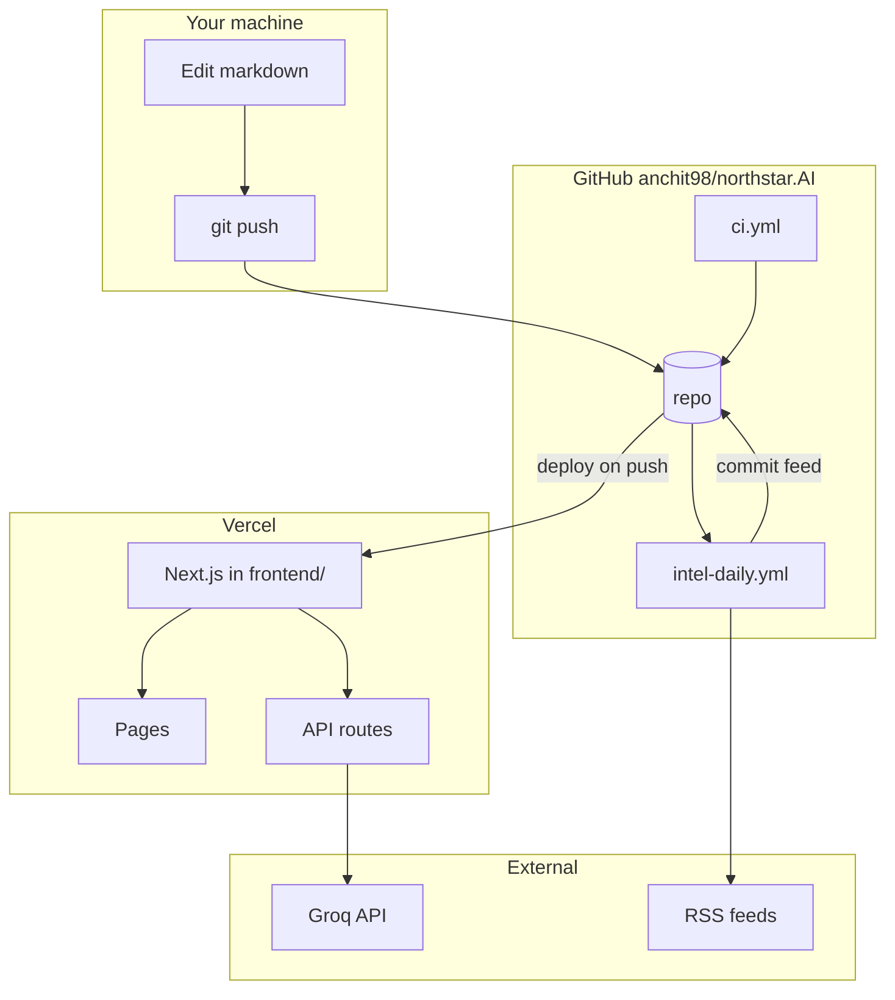

# NorthStar AI — Deployment (GitHub + Vercel)

> **Version:** 1.1 | **Date:** 2026-05-23  
> **Scope:** [GitHub](https://github.com/anchit98/northstar.AI) repository, GitHub Actions, Vercel (frontend + API)  
> **Related:** [architecture.md](./architecture.md) · [decisions.md](./decisions.md) (DEC-17, DEC-19, DEC-20, DEC-22) · [content_contract.md](../frontend/content_contract.md)

---

## 1. Executive summary

NorthStar AI is a **monorepo**: markdown at the repo root (`outputs/`, `inputs/`, `analysis/`, `docs/`), Next.js in `frontend/`.

| Layer | Host | Role |
|-------|------|------|
| **App (UI + API)** | **Vercel** | Public resume routes, open workbench, `/api/intel/*` |
| **Daily RSS ingest** | **GitHub Actions** | `npm run intel:fetch` → commits `outputs/intel/feed/*.md` (no LLM) |
| **CI** | **GitHub Actions** | Lint + build on push/PR |

There is **no separate backend host** and **no Render** — Vercel serverless functions handle API routes; GitHub Actions handle scheduled ingest.

---

## 2. Architecture (deployed)



**Data flow (DEC-19):**

1. Edit markdown under `outputs/`, `inputs/`, `analysis/`.
2. Push to `main` → Vercel rebuilds; app reads `../outputs` from the cloned repo at runtime (`cwd` = `frontend/`).
3. Daily Actions run → new `outputs/intel/feed/YYYY-MM-DD.md` → commit to `main` → Vercel redeploys.

---

## 3. Prerequisites

### Accounts

- [GitHub](https://github.com) — repo: **[anchit98/northstar.AI](https://github.com/anchit98/northstar.AI)**
- [Vercel](https://vercel.com) — link to GitHub
- [Groq](https://console.groq.com) — API key for workbench intel generation (optional locally until you use Generate)

### Local verification (before cloud)

```powershell
# Repo root
npm install
npm run intel:fetch

cd frontend
copy .env.example .env
# Edit .env: GROQ_API_KEY (for intel Generate buttons)
npm install
npm run build
```

If build fails with `EINVAL readlink` on Windows/OneDrive, delete `frontend/.next` and rebuild.

### Secrets hygiene

| Item | Rule |
|------|------|
| `frontend/.env` | Never commit (in `.gitignore`) |
| API keys | Only in Vercel env + local `.env` |
| Sensitive outreach/comp data | Use a **private** GitHub repo if needed |

---

## 4. Setup — step by step

### Step 1 — Push code to GitHub

Repo URL: **https://github.com/anchit98/northstar.AI.git**

From your machine (monorepo root):

```powershell
cd "C:\Users\Anchit.Boruah\OneDrive - insidemedia.net\Desktop\Resume"

git init
git add .
git commit -m "NorthStar AI: monorepo, frontend, intel pipeline, deployment docs"
git branch -M main
git remote add origin https://github.com/anchit98/northstar.AI.git

# If the remote already has commits (e.g. README), merge histories once:
git pull origin main --allow-unrelated-histories --no-edit

git push -u origin main
```

If `git pull` reports conflicts on `README.md`, resolve (keep monorepo README + optional GitHub overview), then:

```powershell
git add README.md
git commit -m "Merge remote README with monorepo"
git push -u origin main
```

> Use a **private** repo in GitHub Settings if `outputs/` contains outreach, comp, or employer-sensitive content.

### Step 2 — Enable GitHub Actions

1. GitHub → **anchit98/northstar.AI** → **Settings** → **Actions** → **General**
2. Allow all actions (or allow this repository).
3. **Workflow permissions** → **Read and write permissions** (required for intel daily auto-commit).

**Workflows in this repo:**

| Workflow | File | Trigger |
|----------|------|---------|
| Intel daily feed | `.github/workflows/intel-daily.yml` | Cron `30 1 * * *` UTC (~07:00 IST) + manual |
| CI | `.github/workflows/ci.yml` | Push/PR to `main` |

**Test intel ingest:** Actions → **Intel Daily Feed** → **Run workflow** → confirm a new commit under `outputs/intel/feed/`.

### Step 3 — Import project on Vercel

1. [vercel.com](https://vercel.com) → **Add New** → **Project** → Import **northstar.AI** from GitHub.
2. **Root Directory:** `frontend` (required for monorepo).
3. **Framework:** Next.js (auto).
4. **Build Command:** `npm run build`
5. **Install Command:** `npm ci`
6. Deploy once (env vars can be added before or after first deploy).

### Step 4 — Vercel environment variables

Vercel → Project → **Settings** → **Environment Variables** → **Production** (and **Preview** if you use branch deploys):

| Variable | Required | Notes |
|----------|----------|--------|
| `GROQ_API_KEY` | **Yes** (for Generate buttons) | Server-only |
| `GROQ_MODEL` | Optional | Default: `meta-llama/llama-4-scout-17b-16e-instruct` |

Redeploy after saving env vars (**Deployments** → ⋮ → **Redeploy**).

### Step 5 — Custom domain (optional, DEC-17)

1. Vercel → **Settings** → **Domains** → add e.g. `northstar.yourdomain.com`.
2. At your DNS provider: `CNAME` to the target Vercel shows (e.g. `cname.vercel-dns.com`).
3. Wait for SSL; smoke-test HTTPS.

### Step 6 — Production smoke test

| Check | URL / action | Expected |
|-------|----------------|----------|
| Public resume | `/resume/one-page` | Renders |
| Workbench | `/workbench` | Opens directly (no passcode) |
| Intel feed | `/workbench/intel/feed` | Latest `feed/YYYY-MM-DD.md` |
| Mobile nav | Resize to phone width | Bottom nav + menu work |

### Step 7 — Intel LLM on Vercel (know this limit)

`POST /api/intel/weekly` and `POST /api/intel/posts` write to `outputs/intel/` on the **ephemeral** serverless filesystem. Files **do not persist** on Vercel after the request ends.

| Environment | Weekly/posts files |
|-------------|-------------------|
| Local `npm run dev` | Saved in repo on disk |
| Vercel | Use UI to **copy** output, or generate locally and commit |

---

## 5. Ongoing operations

| Task | How |
|------|-----|
| Ship UI/docs changes | `git push` to `main` → Vercel deploy |
| Refresh daily RSS | Automatic via `intel-daily.yml`, or manual workflow run |
| Add/remove feeds | Edit `outputs/intel/sources.md`, push; next fetch uses registry |
| Workbench access | Open `/workbench` (no login) |
| Preview branch | Push to `develop` (optional) → Vercel preview URL |

---

## 6. Security checklist

| # | Check |
|---|--------|
| 1 | `GROQ_API_KEY` not in git |
| 2 | Repo visibility matches sensitivity of `outputs/` |
| 3 | [content_contract.md](../frontend/content_contract.md) — public routes only resume/projects/branding |
| 4 | `/workbench/*` has `X-Robots-Tag: noindex` (middleware) |
| 5 | Intel LLM persistence understood (§ Step 7) |

---

## 7. Troubleshooting

| Issue | Fix |
|-------|-----|
| Vercel: `outputs/` not found | Root Directory must be `frontend`, full repo connected |
| Build `EINVAL readlink` (Windows) | Delete `frontend/.next`, rebuild outside OneDrive sync if possible |
| Workbench 404 | Confirm Vercel root directory is `frontend` |
| Groq 502 on Generate | Check `GROQ_API_KEY`, model name, payload size |
| Feed empty on production | Run **Intel Daily Feed** workflow; confirm commit on `main`; wait for redeploy |
| Actions cannot commit | Workflow permissions → Read and write |
| Push rejected | `git pull --rebase origin main` then push |

---

## 8. Deployment sequence (checklist)

```text
□ Local: npm run intel:fetch + frontend npm run build
□ git push to github.com/anchit98/northstar.AI (main)
□ GitHub Actions: Intel Daily Feed manual run → feed commit
□ GitHub Actions: CI green
□ Vercel: import repo, root directory frontend
□ Vercel: GROQ_API_KEY
□ Smoke test public + workbench + intel feed
□ (Optional) Custom domain on Vercel
```

---

## 9. Local-only mode (DEC-22)

Skip Vercel entirely: `npm run dev` in `frontend/` and `npm run intel:fetch` at repo root. Use this doc when you choose cloud hosting.

---

## 10. Revision history

| Version | Date | Change |
|---------|------|--------|
| 1.0 | 2026-05-23 | Initial plan (included optional Render) |
| 1.1 | 2026-05-23 | Render removed; GitHub + Vercel only; setup steps for anchit98/northstar.AI; ci.yml committed |
