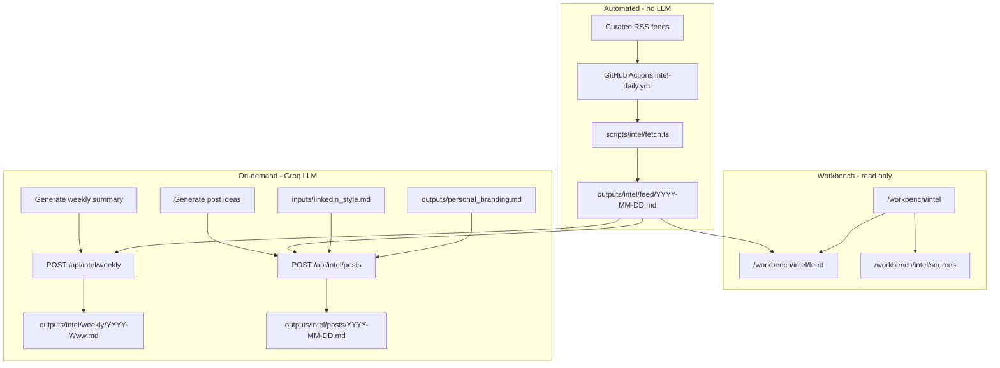
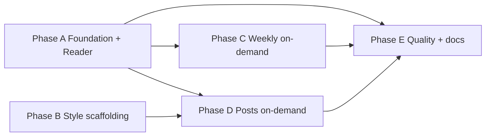

# Phase 12: Intel & Content Engine — Detailed Plan

> **Version:** 1.0 | **Date:** 2026-05-22  
> **Status:** Phases A–E complete (candidate Groq smoke-test optional)  
> **Parent:** [architecture.md](./architecture.md) · [decisions.md](./decisions.md) (DEC-24–26) · [edgecases.md](./edgecases.md) (EC-12.1–EC-12.8) · [resume_structure.md](./resume_structure.md)  
> **Related branding:** [outputs/personal_branding.md](../outputs/personal_branding.md)

---

## 1. Executive summary

Phase 12 adds a **PM + AI intelligence module** inside NorthStar AI so you can:

1. **Stay current** — daily raw articles and updates from curated, reliable RSS sources (no LLM on the daily path).
2. **Synthesize when you want** — weekly summary generated only when you click **Generate this week's summary**.
3. **Build visibility** — LinkedIn post **ideas** in your voice, only when you click **Generate post ideas**, grounded in recent feed items + your content pillars + optional sample posts.

**Design principle (v2):** The daily pipeline is a **feed reader**, not an AI digest. LLM usage is **on-demand only** (Groq via local API routes). No automatic synthesis cron. No LinkedIn auto-post.

| Track | Automation | LLM |
|-------|------------|-----|
| Daily RSS ingest | GitHub Actions cron (~06:30 IST) | None |
| Daily reading | Workbench `/workbench/intel/feed` | None |
| Weekly summary | Manual button → `POST /api/intel/weekly` | Groq (on click) |
| LinkedIn post ideas | Manual button → `POST /api/intel/posts` | Groq (on click) |

---

## 2. Goals and non-goals

### Goals

- Aggregate **~20 curated RSS feeds** across PM craft, AI labs, AI-for-PM, Indian startup PM, and product-building essays.
- Store each day's items as **markdown-as-is** (title, link, published date, RSS summary text unchanged).
- Render feeds in the **private workbench** with date navigation and source health visibility.
- Let you generate a **weekly synthesis** from the last 7 days of feed files when you choose.
- Let you generate **2–3 LinkedIn draft variants** per run, tagged by content pillar, mimicking `inputs/linkedin_style.md` when populated and falling back to `outputs/personal_branding.md`.
- Keep all artifacts in `outputs/intel/` for version control and DEC-19 build-time reads.

### Non-goals (v1)

- Automatic LLM on any schedule (daily, weekly, or posts).
- LinkedIn API posting, scheduling, or analytics.
- Scraping LinkedIn profiles, Twitter/X, or paywalled content.
- Email, Slack, or push notifications.
- Production deploy of new routes (DEC-22 — local/private NorthStar AI remains default).
- Replacing your manual reading — the feed is the source of truth; LLM outputs are drafts you review.

---

## 3. Architecture overview



### Key decisions (recorded in [decisions.md](./decisions.md))

| ID | Decision |
|----|----------|
| **DEC-24** | Intel module lives in-repo; RSS-only ingestion; markdown artifacts in `outputs/intel/`. |
| **DEC-25** | **No LLM on daily path.** Weekly and LinkedIn drafts are **manual trigger only** via workbench API routes. |
| **DEC-26** | Post ideas use **both** `inputs/linkedin_style.md` (sample posts) and `outputs/personal_branding.md` (pillars). No enforced posting cadence; no auto-publish. |

---

## 4. Directory and file contract

```
outputs/intel/
  README.md                 # Operator guide
  sources.md                # Curated feeds: name, category, RSS URL, notes
  feed/
    YYYY-MM-DD.md           # Daily raw ingest (NO LLM)
  weekly/
    YYYY-Www.md             # On-demand weekly synthesis only
  posts/
    YYYY-MM-DD.md           # On-demand LinkedIn drafts only
  _archive/                 # Feed/weekly/posts older than 90 days

inputs/
  linkedin_style.md         # 3–5 past LinkedIn posts (your voice samples)

scripts/intel/
  fetch.ts                  # RSS → feed/ (cron-invoked)
  lib/
    sources.ts              # Parse sources.md
    markdown.ts             # Frontmatter + body writers

prompts/
  intel_weekly.md           # Weekly synthesis prompt spec
  intel_post.md             # LinkedIn draft prompt spec

frontend/
  lib/intel.ts              # List/read feed, weekly, posts by date
  app/(workbench)/workbench/intel/...
  app/api/intel/
    weekly/route.ts         # POST — Groq weekly
    posts/route.ts          # POST — Groq posts

.github/workflows/
  intel-daily.yml           # Fetch RSS only; commit feed file
```

**Explicitly excluded:** `synthesize-daily.ts`, `intel-weekly.yml` (synthesis cron), `draft-posts.ts` (posts cron).

---

## 5. Curated sources (~20 feeds)

Maintained in [outputs/intel/sources.md](../outputs/intel/sources.md). Starter categories:

| Category | Examples (RSS where available) |
|----------|--------------------------------|
| PM thought leaders | Lenny's Newsletter, Aakash Gupta, Shreyas Doshi, Marty Cagan (SVPG), Mind the Product, Reforge, Aatir Abdul Rauf, Pawel Huryn |
| AI labs / research | Anthropic news, OpenAI blog, Google DeepMind, Hugging Face daily papers |
| AI PM / builders | Latent Space, AI Tidbits, The Rundown AI, Ben's Bites |
| Indian PM / startup | The Ken (free RSS where available), Bharat PM, ProductGeeks |
| Building / craft | Julian Shapiro, First Round Review, Stratechery (free posts) |

**Rules:**

- RSS (or Atom) URLs only — no HTML scraping in v1.
- Personalities without a public RSS feed are **out of scope** until `manual_inbox.md` (v2).
- Dead feeds are flagged in frontmatter and on `/workbench/intel/sources` health badge.

---

## 6. Artifact specifications

### 6.1 Daily feed — `outputs/intel/feed/YYYY-MM-DD.md`

**LLM:** None. Content is RSS-native.

**Frontmatter:**

```yaml
---
date: 2026-05-22
fetched_at: "2026-05-22T06:30:00+05:30"
sources_healthy: 18
sources_dead: 2
item_count: 47
---
```

**Body structure:**

- `## {Category name}` (from sources.md)
- Per item:
  - **Title** — markdown link to original URL
  - **Source** — publication name
  - **Published** — ISO or human date from feed
  - **Summary** — verbatim or lightly trimmed RSS description (no paraphrase by LLM)

**Deduplication:** Same URL within a day = one entry. Same URL across days = allowed (new day file).

---

### 6.2 Weekly summary — `outputs/intel/weekly/YYYY-Www.md`

**LLM:** Groq — **only** when user clicks **Generate this week's summary**.

**Inputs to prompt:**

- All `outputs/intel/feed/*.md` files for the ISO week (Mon–Sun) or last 7 calendar days (configurable in API).
- `prompts/intel_weekly.md` system instructions.

**Required sections:**

1. **Top 5 themes** — each with 1–2 sentence explanation + linked source titles.
2. **Notable launches / product moves** — bullets with links.
3. **Three essays worth reading in full** — title, why it matters, link.
4. **Recurring voices** — who showed up most in the feed this week.
5. **So what for an AI-native PM** — 3–4 bullets tied to your positioning (no fabricated metrics).

**Frontmatter:** `week`, `generated_at`, `feed_days_included`, `model`, `item_count`.

**Citation rule:** Every factual claim must reference a feed item URL present in the week's feed files (EC-12.2).

---

### 6.3 LinkedIn post ideas — `outputs/intel/posts/YYYY-MM-DD.md`

**LLM:** Groq — **only** when user clicks **Generate new ideas**.

**Inputs to prompt:**

- Recent feed items (default: last 3–7 days — API parameter).
- `prompts/intel_post.md`.
- `outputs/personal_branding.md` — pillars 1–3.
- `inputs/linkedin_style.md` — if non-empty, primary voice reference.

**Output per generation:** 2–3 variants, each labeled:

| Pillar | Theme |
|--------|--------|
| Pillar 1 | Industry takes (PM & AI news, POV for founders/leaders) |
| Pillar 2 | AI-native PM craft (RAG, agents, MCP, how you build) |
| Pillar 3 | Product ops & delivery (intake, adoption, internal tools) |
| Pillar 4 | PM journey — early PM, not “just a BA” (fellowship, teardowns) |

**Each variant includes:**

- One **ready-to-paste** LinkedIn post (hook, body, CTA, and hashtags woven in — no `Hook:` / `Body:` labels)
- Pillar tag in HTML comment only (`<!-- meta: pillar-N -->`) for workbench — not copied to LinkedIn
- No required citation link lists (refer to news by name when needed)

**UI:** User picks **one pillar per run** (required); 2 variants for that pillar only. Proof/metrics optional in prompt.

**Cadence:** Informational only — UI may note "Last generated 3 days ago"; no auto-generation on alternate days.

---

## 7. Workbench UI specification

All routes under `(workbench)` — passcode required (DEC-18, DEC-20).

| Route | Purpose | Reads | Actions |
|-------|---------|-------|---------|
| `/workbench/intel` | Hub | Latest feed frontmatter | Links to sub-routes; shows last `fetched_at` |
| `/workbench/intel/feed` | Daily reader | `outputs/intel/feed/*.md` | Date picker; markdown render |
| `/workbench/intel/weekly` | Weekly archive | `outputs/intel/weekly/*.md` | **Generate this week's summary** → API |
| `/workbench/intel/posts` | Post drafts | `outputs/intel/posts/*.md` | **Generate new ideas** → API; optional pillar; Copy button |
| `/workbench/intel/sources` | Source registry | `outputs/intel/sources.md` | Read-only; health badges |

**Hub card** added to [frontend/app/(workbench)/workbench/page.tsx](../frontend/app/(workbench)/workbench/page.tsx) `CARDS` array.

**Content contract** entries in [frontend/content_contract.md](../frontend/content_contract.md).

**Security:** `GROQ_API_KEY` only in server-side API routes — never exposed to client bundle.

---

## 8. Quality gate G11 — Intel & Content Engine

| Criterion | Pass condition |
|-----------|----------------|
| Source health | ≥ 10 of ~20 feeds returning items in last 7 days |
| Daily ingest | `feed/YYYY-MM-DD.md` exists for each day cron ran (or manual `npm run intel:fetch`) |
| Weekly generation | One successful on-demand weekly run produces valid markdown with linked citations |
| Post generation | One successful on-demand post run produces 2+ variants with pillar tags |
| Authenticity | Candidate reviews posts before publishing (G5-lite); no auto-post |
| LLM boundary | No LLM invoked by `intel-daily.yml` workflow |

---

## 9. Edge cases (recorded in [edgecases.md](./edgecases.md) — Stage 12)

| ID | Trigger | Mitigation |
|----|---------|------------|
| EC-12.1 | RSS feed dead or moved | Health badge on sources page; skip in fetch; log in frontmatter |
| EC-12.2 | Weekly/post cites URL not in feed | Prompt requires citations; post-process validation warns in API response |
| EC-12.3 | Draft off-brand or too generic | Pillar + style files in prompt; user regenerates or edits |
| EC-12.4 | `linkedin_style.md` empty | Fallback to personal_branding.md tone only (DEC-26) |
| EC-12.5 | `feed/` grows large | Archive files > 90 days to `_archive/` (manual or script) |
| EC-12.6 | Groq rate limit / API error | API returns error toast; no partial file write |
| EC-12.7 | Duplicate items across sources | Dedup by canonical URL per day |
| EC-12.8 | LLM accidentally added to daily cron | No Groq in fetch script; workflow header comment; review checklist |

---

## 10. Secrets, cost, and operations

| Component | Secret | Cost |
|-----------|--------|------|
| Daily cron | `GITHUB_TOKEN` or default Actions permissions for commit | $0 |
| Weekly API | `GROQ_API_KEY` in `frontend/.env` | On demand; Groq free tier typically sufficient |
| Posts API | Same `GROQ_API_KEY` | On demand |

**G11 attestation:** [outputs/intel/README.md](../outputs/intel/README.md#g11-attestation-quality-gate).

**Local dev:**

```bash
# After Phase A
npm run intel:fetch   # optional script alias → ts-node scripts/intel/fetch.ts

# After Phase C/D
cd frontend && npm run dev
# Use workbench buttons; requires GROQ_API_KEY in frontend/.env
```

**Cron schedule (proposed):** `30 1 * * *` UTC ≈ 07:00 IST — adjust in `intel-daily.yml`.

---

## 11. Implementation phases (detailed)

### Phase A — Foundation + daily reader

**Objective:** Working RSS ingest and read-only workbench — **no LLM**.

**Duration (est.):** 2–3 working days

**Owners:** Developer (scripts + frontend) · Candidate (review/approve `sources.md` list)

#### A.1 — Source registry

| Task | Deliverable |
|------|-------------|
| Create `outputs/intel/README.md` | Operator documentation |
| Create `outputs/intel/sources.md` | ~20 feeds with category, name, RSS URL, enabled flag |
| Seed categories | PM leaders, AI labs, AI PM, Indian PM, craft |

**Exit:** `sources.md` reviewed by candidate; all URLs resolve to valid RSS/Atom.

#### A.2 — Fetch script (no LLM)

| Task | Deliverable |
|------|-------------|
| Add `rss-parser` dependency (repo root or `scripts/` package) | `package.json` script entry |
| Implement `scripts/intel/fetch.ts` | Reads sources → writes `feed/YYYY-MM-DD.md` |
| Implement `scripts/intel/lib/sources.ts` | Parser for sources.md |
| Implement `scripts/intel/lib/markdown.ts` | Frontmatter + grouped body writer |
| Dedup | Same-day link dedup; cross-day skip if link, source+title, or source+summary already in last 14 days (`scripts/intel/lib/dedup.ts`) |

**Exit:** `npm run intel:fetch` produces today's feed file locally.

#### A.3 — GitHub Actions cron

| Task | Deliverable |
|------|-------------|
| Create `.github/workflows/intel-daily.yml` | Schedule + checkout + Node + fetch + commit |
| Commit path | Only `outputs/intel/feed/YYYY-MM-DD.md` (and updated health in sources if needed) |

**Exit:** Workflow runs green on manual `workflow_dispatch`; feed file appears in repo.

#### A.4 — Workbench reader UI

| Task | Deliverable |
|------|-------------|
| `frontend/lib/intel.ts` | `listFeedDates()`, `getFeedByDate()`, `getSourcesMeta()` |
| `/workbench/intel/page.tsx` | Hub with 4 cards + last fetched |
| `/workbench/intel/feed/page.tsx` | Date list + markdown render |
| `/workbench/intel/sources/page.tsx` | Render sources.md |
| Update workbench `CARDS` | Intel hub entry |
| Update `content_contract.md` | Route → file mapping |

**Exit:** `npm run dev` → passcode → view today's feed as rendered markdown.

#### Phase A checklist

- [x] `outputs/intel/sources.md` complete
- [x] `scripts/intel/fetch.ts` runs locally
- [x] `.github/workflows/intel-daily.yml` commits feed file
- [x] `/workbench/intel` and `/workbench/intel/feed` render correctly
- [x] No Groq import anywhere in fetch path or daily workflow

---

### Phase B — Style scaffolding

**Objective:** Inputs ready for on-demand LinkedIn generation (Phase D).

**Duration (est.):** 0.5 day

**Owners:** Candidate (paste sample posts) · System (template)

#### B.1 — LinkedIn style file

| Task | Deliverable |
|------|-------------|
| Create `inputs/linkedin_style.md` | Template with 3–5 placeholder sections |
| Document in README | How to paste full text of past posts |
| Link from `outputs/personal_branding.md` | Cross-reference pillars |

**Exit:** File exists; candidate knows to fill samples before first post generation.

#### B.2 — Pillar mapping doc

| Task | Deliverable |
|------|-------------|
| Confirm pillars in `personal_branding.md` §3 | Pillar 1 / 2 / 3 titles match `intel_post.md` |

**Exit:** Single source of truth for pillar names across branding + intel prompts.

#### Phase B checklist

- [x] `inputs/linkedin_style.md` created
- [x] `personal_branding.md` links to intel post flow
- [x] `prompts/intel_post.md` stub references both files

---

### Phase C — Weekly summary (on-demand)

**Objective:** Button-triggered weekly synthesis with Groq.

**Duration (est.):** 2–3 working days

**Owners:** Developer · Candidate (review first outputs for citation quality)

#### C.1 — Prompt

| Task | Deliverable |
|------|-------------|
| Write `prompts/intel_weekly.md` | Section structure, citation rules, tone (analytical, concise) |
| Input contract | Last 7 `feed/*.md` concatenated or summarized by script before LLM |

**Exit:** Prompt reviewed; no fabrication instructions explicit.

#### C.2 — API route

| Task | Deliverable |
|------|-------------|
| `frontend/app/api/intel/weekly/route.ts` | POST; read feeds; call Groq; write `weekly/YYYY-Www.md` |
| `frontend/lib/groq.ts` (or inline) | Server-only Groq client |
| Error handling | EC-12.6; no write on failure |

**Exit:** POST returns success + path; file readable in workbench.

#### C.3 — Weekly UI

| Task | Deliverable |
|------|-------------|
| `/workbench/intel/weekly/page.tsx` | List past weeks + viewer |
| Generate button | Loading state; refresh after write |
| `content_contract.md` | weekly route entry |

**Exit:** One full week of feed data → click generate → readable weekly doc.

#### Phase C checklist

- [x] `prompts/intel_weekly.md` complete
- [x] `POST /api/intel/weekly` works with `GROQ_API_KEY`
- [x] `outputs/intel/weekly/YYYY-Www.md` written on success
- [x] Citations point to real feed URLs (API warns on mismatch)
- [x] No cron invokes weekly synthesis

---

### Phase D — LinkedIn post ideas (on-demand)

**Objective:** Button-triggered drafts in candidate voice.

**Duration (est.):** 2–3 working days

**Owners:** Developer · Candidate (fill style samples, attest drafts before posting)

#### D.1 — Prompt

| Task | Deliverable |
|------|-------------|
| Write `prompts/intel_post.md` | Style mimicry, pillar rotation, citation rules, hashtag format |
| DEC-4 / DEC-9 | No invented metrics; feed + inputs only |

**Exit:** Prompt tested with empty vs populated `linkedin_style.md`.

#### D.2 — API route

| Task | Deliverable |
|------|-------------|
| `frontend/app/api/intel/posts/route.ts` | POST; optional `pillar` body field |
| Read `linkedin_style.md`, `personal_branding.md`, recent feeds | Context assembly |
| Write `posts/YYYY-MM-DD.md` | 2–3 variants per run |

**Exit:** POST returns variants; file has copy-friendly sections.

#### D.3 — Posts UI

| Task | Deliverable |
|------|-------------|
| `/workbench/intel/posts/page.tsx` | History + generate UI |
| Pillar dropdown | Optional: All / Pillar 1 / 2 / 3 |
| Copy button per variant | Clipboard API |
| Soft reminder | "Last generated X days ago" (optional) |

**Exit:** Generate → review → copy to LinkedIn manually.

#### Phase D checklist

- [x] `prompts/intel_post.md` complete (v1.0 — aligned with Phase C feed modes)
- [x] `POST /api/intel/posts` works (requires `GROQ_API_KEY` in `frontend/.env`)
- [x] Voice uses `linkedin_style.md` when `status: ready` (6 samples + voice notes)
- [x] Feed input: `iso-week` | `rolling-7` (shared `resolveFeedContext` with Phase C)
- [x] Optional weekly synthesis excerpt as theme context
- [x] Pillar tags in prompt contract
- [x] No auto-post to LinkedIn

---

### Phase E — Quality loop and documentation sync

**Objective:** Gates, edge cases, housekeeping, architecture cross-links.

**Duration (est.):** 1–2 working days

#### E.1 — Documentation

| Task | Deliverable |
|------|-------------|
| Add Phase 12 section to `architecture.md` | Summary + link to this doc |
| Append DEC-24, DEC-25, DEC-26 to `decisions.md` | ✅ Done |
| Append EC-12.1–EC-12.8 to `edgecases.md` | ✅ Done |
| Phase timeline in `lib/phaseTimeline.ts` | Phase 12 checkboxes (optional) |

#### E.2 — Quality tooling

| Task | Deliverable |
|------|-------------|
| Source health in fetch | Update `sources_healthy` / `sources_dead` counts |
| Citation validator (light) | API warns if weekly/post links not in feed set |
| Archive script or doc | 90-day `feed/` cleanup procedure |
| G11 attestation checkbox | Optional UI note on posts page: "Reviewed before sharing" |

#### E.3 — npm scripts

| Script | Command |
|--------|---------|
| `intel:fetch` | Run fetch locally |
| `intel:archive` | Move feed/weekly/posts older than 90 days to `_archive/` |
| Document in `frontend/README.md` | Intel module usage |

#### Phase E checklist

- [x] G11 criteria documented and testable (`§8`, `outputs/intel/README.md` G11 attestation)
- [x] `architecture.md` references this file + Phase 12 activities + G11 row in §9
- [x] DEC-24–26 recorded
- [x] EC-12.x recorded (EC-12.2: weekly citation warnings; posts optional/no link lists)
- [x] Dead-feed badge on sources page (FAIL styling + summary banner)
- [x] `npm run intel:archive` + root `package.json` script
- [x] `frontend/README.md` intel usage section

---

## 12. Phase dependency graph



- **Phase A** is independently valuable (RSS reader only).
- **Phase B** can run in parallel with A after A.1 sources list exists.
- **Phase C** requires at least 3–7 days of feed files for meaningful output.
- **Phase D** requires Phase B for best results; works without style file (fallback).
- **Phase E** should run last.

---

## 13. Success metrics (Phase 6 alignment)

Optional logging in `analysis/market_feedback.md` or intel frontmatter:

| Signal | How to measure |
|--------|----------------|
| Feed usefulness | You open `/workbench/intel/feed` ≥ 4 days/week |
| Weekly habit | ≥ 1 weekly generation per week during active job search |
| LinkedIn output | ≥ 2 post generations per week; ≥ 1 published manually |
| Source quality | < 5 dead feeds sustained over 14 days |

---

## 14. Revision history

| Version | Date | Change |
|---------|------|--------|
| 1.0 | 2026-05-22 | Initial detailed plan (v2): no LLM on daily; on-demand weekly + posts; style from linkedin_style + personal_branding |

---

*When implementation starts, update checkboxes in §11 and mirror status in `docs/architecture.md` Phase 12 section.*
